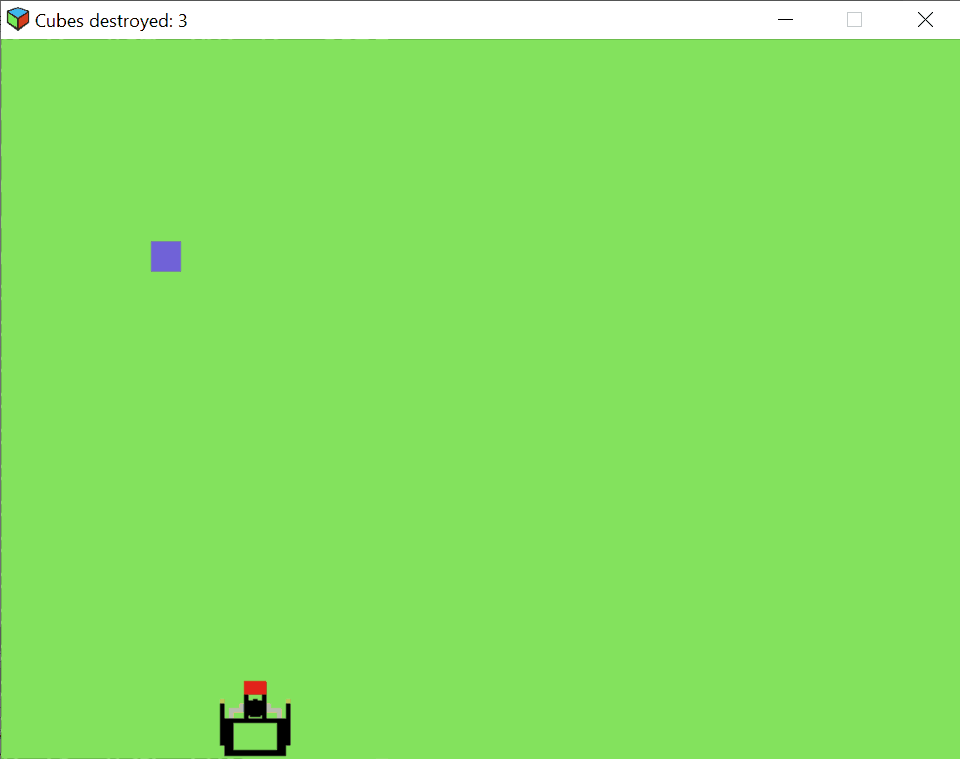

# CPPND: Capstone Cube Defender

This is a cube defender game created as a C++ capstone project for udacity.

##Game Description
In this game, you play as a *cube defender* that is on the bottom of the screen. The cubes are changing color as they fall down and they are also accelerating as time goes on.
You can decelerate them by shooting them down. The goal is to shoot down as many cubes as possible,
before one of them reaches the bottom screen(**defender platform**). For comparison the current result is being captured on the window title.

## Game Instructions
* Move left: Hold down key **A**
* Move right: Hold down key **D**
* Shoot: Press key **W**

## Dependencies for Running Locally
* cmake >= 3.7
  * All OSes: [click here for installation instructions](https://cmake.org/install/)
* make >= 4.1 (Linux, Mac), 3.81 (Windows)
  * Linux: make is installed by default on most Linux distros
  * Mac: [install Xcode command line tools to get make](https://developer.apple.com/xcode/features/)
  * Windows: [Click here for installation instructions](http://gnuwin32.sourceforge.net/packages/make.htm)
* SDL2 >= 2.0
  * All installation instructions can be found [here](https://wiki.libsdl.org/Installation)
  * Note that for Linux, an `apt` or `apt-get` installation is preferred to building from source.
* SDL2_image >= 2.0
  * All installation instruction can be found [here](https://www.libsdl.org/projects/SDL_image/)
* gcc/g++ >= 5.4
  * Linux: gcc / g++ is installed by default on most Linux distros
  * Mac: same deal as make - [install Xcode command line tools](https://developer.apple.com/xcode/features/)
  * Windows: recommend using [MinGW](http://www.mingw.org/)

## Basic Build Instructions
1. Clone this repo.
2. Make a build directory in the top level directory: `mkdir build && cd build`
3. Compile: `cmake .. && make`
4. Run it: `./cube-defender`.

## Rubric Points Adressed
### README 
* All Rubric Points
### Compiling and Testing
* All Rubric Points
### Loops, Functions, I/O
* The project demonstrates an understanding of C++ functions and control structures.
* The project reads data from a file and process the data, or the program writes data to a file.
### Object Oriented Programming
* The project uses Object Oriented Programming techniques.
* Classes use appropriate access specifiers for class members.
* Class constructors utilize member initialization lists.
* Classes abstract implementation details from their interfaces.
* Classes encapsulate behavior.
* Classes follow an appropriate inheritance hierarchy.
* Derived class functions override virtual base class functions.
### Memory Management
* The project makes use of references in function declarations.
* The project uses destructors appropriately.

